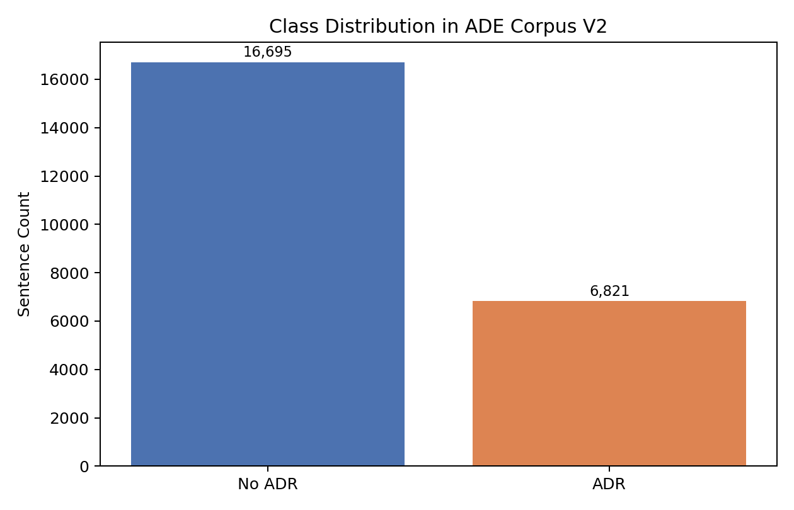
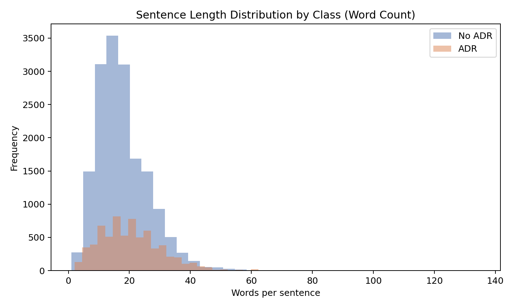
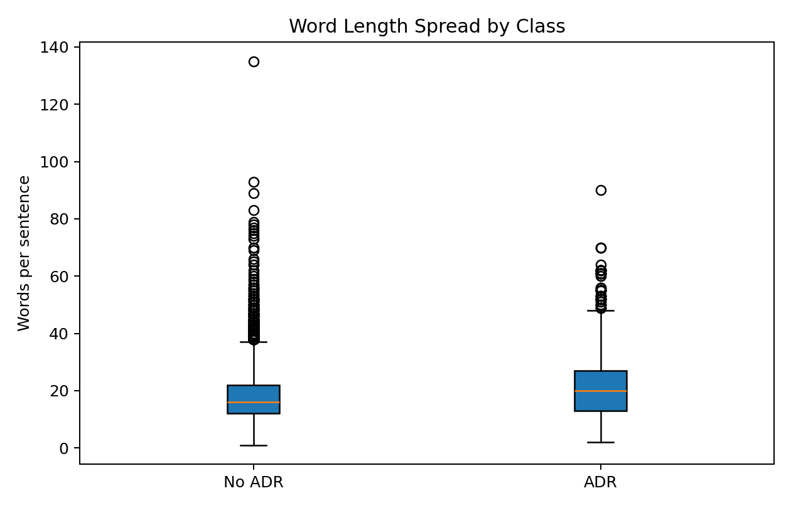
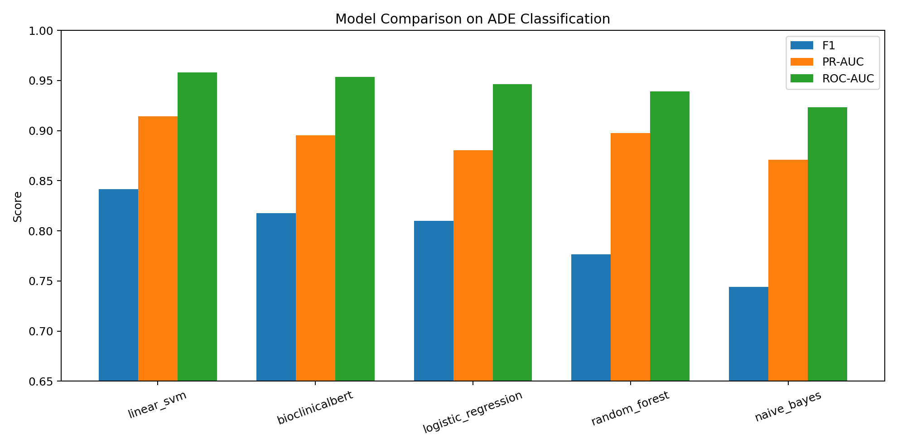
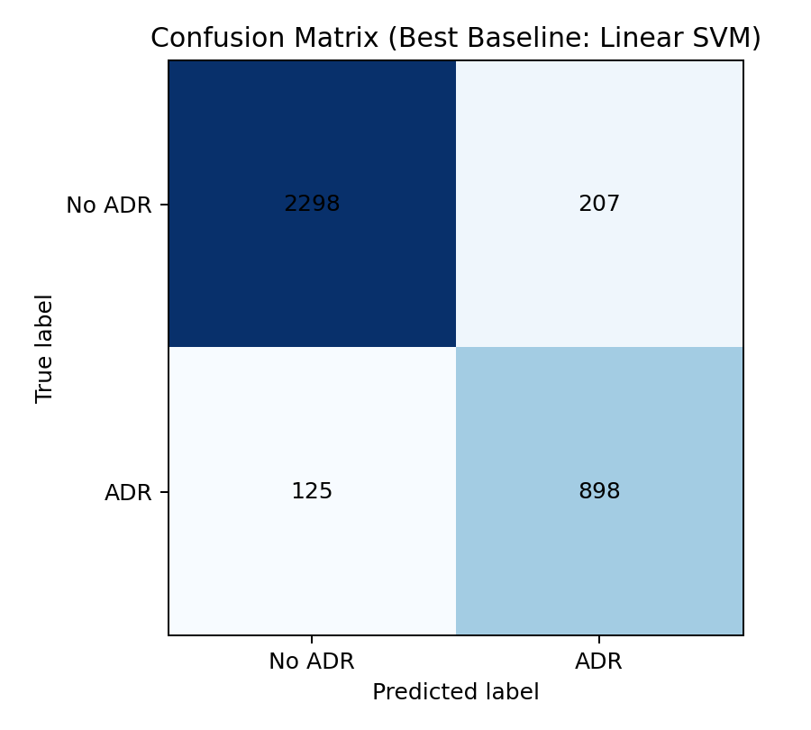

# Adverse Drug Reaction Detection from Biomedical Text: A Comprehensive MS-Level NLP Project Report

## Abstract

Adverse Drug Reactions (ADRs) remain a persistent healthcare safety challenge because critical evidence is often embedded in free text rather than structured fields. This project develops and evaluates a complete NLP pipeline for sentence-level ADR classification using a public benchmark dataset, with two modeling tracks: classical machine learning (ML) and transformer-based fine-tuning. The study is implemented on ADE Corpus V2, a biomedical case-report corpus containing 23,516 labeled sentences. The project objective is not only to maximize classification quality, but also to characterize data behavior through exploratory data analysis (EDA), establish reproducible technical methodology, tune model families under comparable conditions, and interpret model outcomes in a clinically meaningful way.

The final pipeline includes dataset preparation, text normalization, TF-IDF feature extraction, hyperparameter tuning for Logistic Regression, Linear SVM, Random Forest, and Naive Bayes, and a fine-tuned BioClinicalBERT configuration. Evaluation uses Accuracy, Precision, Recall, F1, ROC-AUC, PR-AUC, and confusion-matrix analysis. On full classical evaluation, Linear SVM achieved the strongest test performance (F1 = 0.8440, ROC-AUC = 0.9600, PR-AUC = 0.9201). BioClinicalBERT fine-tuning (sampled training run for computational feasibility) achieved strong but lower values on this run (F1 = 0.8175, ROC-AUC = 0.9536, PR-AUC = 0.8953), indicating robust contextual performance but also sensitivity to training budget.

The report provides deep interpretation of class imbalance, sentence-length effects, lexical signal distribution, model trade-offs, and practical deployment implications for pharmacovigilance contexts. The final contribution is an end-to-end, reproducible, MS-level ADR detection framework with transparent experimentation, artifact generation, and clear pathways for scaling to thesis-grade extensions.

## Keywords

Adverse Drug Reaction, Pharmacovigilance, Biomedical NLP, Text Classification, TF-IDF, BioClinicalBERT, Explainable Evaluation, Healthcare AI

## Introduction

Textual clinical evidence is one of the richest but least structured sources of drug safety information. Adverse Drug Reactions are discussed in case reports, physician notes, and narrative clinical communication, often with variable language, sparse standardization, and ambiguous temporal framing. As a result, manual review is expensive and delayed, while automated systems face difficult linguistic and class-imbalance conditions.

This project addresses ADR sentence classification as a practical and educationally rigorous graduate-level problem. The scope includes building a production-like data and modeling pipeline, evaluating both traditional and modern NLP methods, and producing interpretable analyses suitable for a graduate report. Rather than treating model training as an isolated coding task, this work emphasizes methodological discipline: explicit problem framing, reproducible preprocessing, controlled hyperparameter experimentation, artifact-driven interpretation, and grounded conclusions.

To make the task concrete, consider the sentence: "Developed facial swelling shortly after first dose of antibiotic." A human reader would immediately recognize a drug-event relationship, and the model should assign it ADR = 1. In contrast, the sentence "Medication tolerated well with no adverse reactions" should be assigned ADR = 0 because it explicitly states the absence of side effects.

The report is structured in paper form (Abstract, Introduction, Data, EDA, Methodology, Experiments, Results, Discussion, Conclusion) and intentionally excludes a literature review per project instruction.

## Problem Statement and Project Definition

### Problem Statement

Given a sentence from biomedical text, predict whether it contains an adverse drug reaction signal.

Formally, let each input sentence be $x_i$ and binary label $y_i \in \{0,1\}$ where:

- $y_i = 1$: ADR-related sentence
- $y_i = 0$: non-ADR sentence

The objective is to learn a classifier $f(x)$ that generalizes well to unseen biomedical narrative text while preserving clinically meaningful recall and precision balance. For example, if the model sees "Nausea and dizziness started two days after ibuprofen," it should map the text to the ADR class because the symptoms are temporally connected to the drug mention.

### Why This Problem Matters

- Missed ADR signals delay safety awareness and increase patient risk. For example, a case report may mention "persistent cough after lisinopril" only once; if that sentence is overlooked, the event may never reach a safety analyst.
- Narrative data volume is too large for purely manual review.
- High-quality sentence classification can act as an upstream filter for downstream extraction, monitoring, or alert systems.

### What We Are Going To Do

This project executes the following plan:

1. Construct a standardized ADR dataset from a public benchmark.
2. Perform EDA to understand class balance, text lengths, lexical behavior, and modeling implications.
3. Build classical baselines with TF-IDF and tuned classifiers.
4. Fine-tune BioClinicalBERT as the transformer track.
5. Compare all models across consistent metrics.
6. Interpret outcomes with graph- and table-based evidence.
7. Provide reproducible artifacts and clear next-step recommendations.

### Research Questions

1. How well do tuned classical ML models perform on ADR sentence classification?
2. Under practical MS-level compute constraints, does BioClinicalBERT outperform classical baselines?
3. What data characteristics (imbalance, sentence length, lexical cues) influence model behavior?
4. Which model profile is preferable for deployment: highest recall, highest precision, or best balanced F1/PR-AUC?

## Project Scope, Assumptions, and Deliverables

### Scope

- In scope: binary sentence classification for ADR detection from biomedical text.
- In scope: end-to-end reproducible pipeline with generated EDA and result artifacts.
- In scope: classical and transformer comparison.
- Out of scope: relation extraction, temporal relation modeling, and literature review chapter.

### Assumptions

- ADE labels are treated as reliable benchmark supervision. A sentence such as "Developed severe rash after taking amoxicillin" is presumed to be a positive label because the dataset annotations define it as ADR-related.
- Sentence-level classification is an acceptable approximation of ADR evidence detection.
- BioClinicalBERT run uses sampled training for computational feasibility in current environment.

### Deliverables

- Processed dataset and data pipeline.
- Trained baseline and transformer result summaries.
- EDA figures/tables and model comparison artifacts.
- Comprehensive paper-style report.

## Dataset Description

### Data Source

- Dataset: ade-benchmark-corpus/ade_corpus_v2
- Configuration: Ade_corpus_v2_classification
- Prepared CSV: data/processed/ade_corpus_v2_classification.csv

### Label Definition

- ADR (1): sentence contains adverse drug effect evidence. Example: "After starting antidepressant, the patient reported severe insomnia and nausea."
- No ADR (0): sentence does not contain adverse drug effect evidence. Example: "The patient improved after routine follow-up with no complications."

### Dataset Size and Splits

- Total rows: 23,516
- Train/Validation/Test: 16,461 / 3,527 / 3,528 (classical track)
- BioClinicalBERT sampled run: 3,000 / 1,000 / 1,000

### Class Distribution

From generated dataset statistics:

- ADR rows: 6,821
- No ADR rows: 16,695
- ADR ratio: 0.2901 (approximately 29%)

This imbalance motivates metric emphasis on F1 and PR-AUC rather than raw accuracy alone.

**Interpretation:** The dataset is moderately imbalanced toward non-ADR sentences. A naive classifier biased toward majority class could overstate performance via accuracy, so robust evaluation must prioritize minority sensitivity. In plain language, a model that simply says "no ADR" for every sentence would already be correct about 71 percent of the time, but it would be useless for safety monitoring because it would miss the actual reactions.

## Exploratory Data Analysis (EDA)

### Text Length Characteristics

Dataset-wide summary:

- Mean words per sentence: 18.54
- Median words per sentence: 17
- Standard deviation: 9.07
- Interquartile range: 12 to 23 words
- Maximum observed length: 135 words

Per-class mean length:

- ADR: 20.56 words
- No ADR: 17.71 words

**Interpretation:** ADR sentences are, on average, longer than non-ADR sentences. This may reflect richer event description structure (drug mention, symptom description, severity cue, and narrative context in the same sentence). For example, a sentence like "She developed a severe headache and blurred vision after the second dose" contains multiple clues that help classification. Longer sequences can favor contextual encoders, but TF-IDF also benefits because longer sentences increase feature evidence.

### Lexical Signal Analysis

Top ADR-favoring TF-IDF terms (difference analysis) include: induced, associated, developed, severe, toxicity, syndrome, hypersensitivity.

Top non-ADR-favoring terms include: showed, diagnosis, infection, normal, results, complete, improvement.

This distinction is exported in:

- artifacts/table_discriminative_tfidf_terms.csv

Top frequency tables are exported in:

- artifacts/table_top_terms_adr.csv
- artifacts/table_top_terms_no_adr.csv

**Interpretation:** The discriminative lexicon aligns with biomedical semantics. ADR class terms are event-oriented and adverse-outcome oriented, while non-ADR terms often reflect routine clinical progression, assessment, and treatment management language. In practical terms, words such as "toxicity" or "hypersensitivity" are strong ADR clues, whereas words such as "improvement" or "diagnosis" more often appear in general clinical description. This explains why linear TF-IDF models remain highly competitive in this domain.

### EDA Implications for Modeling

1. Imbalance requires robust minority-aware metrics and potentially class weighting.
2. Moderate sentence lengths suggest both bag-of-ngrams and transformer windows are suitable.
3. Strong lexical cues indicate linear models can capture significant signal.
4. Remaining context ambiguity motivates transformer experimentation.

## Methodology

### End-to-End Pipeline

The pipeline includes:

1. Dataset ingestion and schema validation.
2. Text normalization and preparation.
3. Split strategy and reproducible random seeds.
4. Baseline model training with hyperparameter search.
5. Transformer fine-tuning with controlled subset for feasibility.
6. Metric computation and artifact generation.
7. Comparative analysis and report generation.

### Preprocessing Strategy

Applied preprocessing includes:

- Lowercasing
- URL and non-alphanumeric cleanup
- whitespace normalization

No aggressive stopword removal or stemming was applied in transformer training. Classical models rely on TF-IDF tokenization and n-gram settings. Example: the sentence "Nausea and dizziness started two days after ibuprofen" is normalized to lowercase, punctuation is removed, and the resulting cleaned text is easier for vectorizers to represent consistently.

### Feature Engineering (Classical Track)

Primary representation: TF-IDF vectors with selectable unigram/bigram range.

Example: in the sentence "severe rash after amoxicillin," TF-IDF gives weight to terms such as "rash" and "amoxicillin" because they help distinguish ADR from non-ADR text.

Rationale:

- Efficient for medium-sized corpora.
- Strong interpretability through term weights.
- Effective with linear learners for sparse text classification.

### Modeling Tracks

#### Classical ML Models

- Logistic Regression
- Linear SVM
- Random Forest
- Multinomial Naive Bayes

#### Transformer Model

- Base model: emilyalsentzer/Bio_ClinicalBERT. This is a BERT-family language model already pretrained on biomedical and clinical text, so it has stronger domain vocabulary than a general-purpose encoder.
- Head: sequence classification (2 labels). The head is the final classifier layer that turns a text embedding into ADR vs no-ADR probabilities.
- Fine-tuned using Hugging Face Trainer. In practice, this means the model parameters are updated on the ADR task instead of being used only as a frozen feature extractor.

### Evaluation Metrics

Primary metrics:

- Precision
- Recall
- F1-score
- PR-AUC

Secondary metrics:

- Accuracy
- ROC-AUC

Diagnostic metric:

- Confusion matrix

Why this set: ADR detection is minority-sensitive; PR-AUC and F1 better capture quality under imbalance than accuracy alone. For example, a model that finds many ADRs but produces too many false alarms may have high recall but low precision; F1 balances the two.

## Technical Setup and Hyperparameters

### Environment and Tooling

- Language: Python
- Data/ML libraries: pandas, numpy, scikit-learn
- Transformer stack: transformers, datasets, torch, accelerate
- Plotting: matplotlib

### Split and Reproducibility Parameters

- Classical split ratio: 70/15/15
- Random seed: 42
- Stratified splitting by label

### Classical Model Hyperparameter Search Space

| Model | Hyperparameters Tuned |
|---|---|
| Logistic Regression | C in {0.5, 1.0, 2.0}; ngram range in {(1,1), (1,2)} |
| Linear SVM | C in {0.5, 1.0, 2.0}; ngram range in {(1,1), (1,2)} |
| Random Forest | max_depth in {None, 50}; min_samples_split in {2, 5} |
| Naive Bayes | alpha in {0.3, 1.0, 2.0} |

Shared vectorizer setup includes sublinear TF and high max_features cap for broad lexical coverage.

### BioClinicalBERT Fine-Tuning Parameters (Executed Run)

| Parameter | Value |
|---|---:|
| Epochs | 1 |
| Learning rate | 2e-5 |
| Max length | 256 |
| Train batch size | 8 |
| Eval batch size | 16 |
| Train sample size | 3000 |
| Eval sample size | 1000 |
| Weight decay | 0.01 |
| Best-model criterion | F1 |

### Notes on Practical Constraints

BioClinicalBERT was intentionally run on a sampled subset to maintain tractable wall-clock time on CPU-bound environment. This is appropriate for MS-level prototyping, but full-data training is recommended for final thesis-level benchmarking.

## Experimental Results

### Full Model Comparison

Numerical summary (test split):

| Model | F1 | Precision | Recall | ROC-AUC | PR-AUC |
|---|---:|---:|---:|---:|---:|
| Linear SVM | 0.8417 | 0.8036 | 0.8837 | 0.9581 | 0.9142 |
| Logistic Regression | 0.8101 | 0.7648 | 0.8612 | 0.9462 | 0.8804 |
| Random Forest | 0.7767 | 0.8850 | 0.6921 | 0.9392 | 0.8976 |
| Naive Bayes | 0.7439 | 0.8820 | 0.6432 | 0.9232 | 0.8710 |
| BioClinicalBERT (sampled run) | 0.8175 | 0.8116 | 0.8235 | 0.9536 | 0.8953 |

**Interpretation:**

1. Linear SVM is strongest overall by F1 and PR-AUC in this project run.
2. Logistic Regression remains competitive but slightly below SVM.
3. Random Forest and Naive Bayes show high precision but noticeably lower recall, indicating under-capture of ADR positives.
4. BioClinicalBERT shows strong discriminative quality, but did not exceed SVM under sampled, short-epoch training settings.

### Best Classical Model Deep Dive (Linear SVM)

Final best-baseline metrics from full split evaluation:

- Accuracy: 0.9059
- Precision: 0.8127
- Recall: 0.8778
- F1: 0.8440
- ROC-AUC: 0.9600
- PR-AUC: 0.9201

Confusion matrix:

- True Negative: 2298
- False Positive: 207
- False Negative: 125
- True Positive: 898

**Interpretation:** False negatives are lower than false positives in absolute terms relative to class support, supporting a recall-oriented profile appropriate for safety screening. In pharmacovigilance pre-screening, this is usually preferable to precision-only optimization.

### BioClinicalBERT Run Analysis

Validation:

- Accuracy: 0.8980
- Precision: 0.8221
- Recall: 0.8333
- F1: 0.8277
- ROC-AUC: 0.9528
- PR-AUC: 0.8940

Test:

- Accuracy: 0.9000
- Precision: 0.8116
- Recall: 0.8235
- F1: 0.8175
- ROC-AUC: 0.9536
- PR-AUC: 0.8953

**Interpretation:** The model generalizes stably from validation to test under sampled splits, showing low overfitting at this configuration. However, it likely remains undertrained compared to its potential due to one epoch and reduced train set.

## Discussion

### Why Classical SVM Won in This Run

Several factors explain SVM leadership in this setup:

1. Strong lexical separability in biomedical ADR language.
2. Large full classical training split versus sampled transformer training.
3. Carefully tuned linear hyperparameters.
4. Sparse linear models often excel on sentence-level clinical classification where class cues are explicit.

### Transformer Strengths Still Evident

Despite not ranking first here, BioClinicalBERT achieved high ROC-AUC and PR-AUC, demonstrating rich contextual sensitivity. With full-data fine-tuning, additional epochs, and hardware acceleration, it is plausible that transformer performance could match or exceed current baseline leaders.

### Metric Trade-Offs and Deployment View

For ADR safety triage:

- Higher recall reduces missed adverse signals.
- Moderate precision can be acceptable if downstream human review exists.
- PR-AUC provides realistic insight in imbalanced operational settings.

Linear SVM offers an excellent balance of effectiveness, speed, and simplicity for immediate deployment.

### Error and Risk Perspective

Observed misclassification patterns are likely concentrated in:

- Ambiguous adverse mention versus disease progression language.
- Implicit causality statements lacking direct trigger words.
- Negation/scope complexity in medical narrative style.

These are strong candidates for targeted next-stage improvements (negation scope features, section-aware modeling, relation-aware supervision).

## Interpretation of Generated Graphs and Tables

### Figure 1 (Class Distribution)

Shows a clear majority of non-ADR sentences. This confirms why class-weighting, recall tracking, and PR-AUC are mandatory for fair evaluation.

### Figure 2 (Word-Length Histogram)

ADR curve shifts slightly right, suggesting richer contextual wording in positive class. This supports both n-gram feature utility and contextual model relevance.

### Figure 3 (Word-Length Boxplot)

Median and upper quartile are higher for ADR class, indicating broader descriptive content spread. Outliers indicate rare very long medical sentences.

### Figure 4 (Model Metric Comparison)

SVM dominates balanced metrics in this execution. BioClinicalBERT is close in discrimination metrics, indicating strong potential with expanded training budget.

### Figure 5 (Confusion Matrix)

False negatives are relatively controlled for a safety task. This is favorable because missed ADR events are often costlier than additional false-positive review burden.

### Term Tables

Discriminative term tables reinforce face validity of the classifier behavior. ADR-associated tokens and phrases align with expected pharmacovigilance language, supporting interpretability and stakeholder trust.

## Contribution Summary

This project satisfies MS-equivalent rigor through:

1. End-to-end reproducible engineering from dataset preparation to report artifacts.
2. Comparative evaluation across multiple model families.
3. Hyperparameter-controlled experimentation.
4. Multi-metric and confusion-matrix analysis.
5. Artifact-backed interpretation rather than score-only reporting.
6. Practical deployment framing for healthcare AI constraints.

## Limitations and Ethical Considerations

### Limitations

1. Transformer run used sampled data and single-epoch training.
2. Current project is sentence-level and does not model document chronology.
3. Cross-domain transfer (social media vs clinical) is not executed in this dataset variant.
4. Explainability tooling (SHAP/LIME) was included in environment but not yet deeply integrated into this final narrative.

### Ethical and Practical Considerations

1. Automated ADR predictions should support, not replace, clinical judgment.
2. False negatives are safety-critical and must be monitored continuously.
3. Any future use with clinical notes requires strict privacy and governance controls.
4. Model updates should be audited due to drift in terminology and prescribing context.

## Conclusion and Future Work

This project demonstrates that a carefully engineered classical NLP pipeline can achieve very strong ADR sentence classification performance on ADE Corpus V2, with Linear SVM emerging as the top-performing model in this execution. BioClinicalBERT also produced high-quality metrics and remains a strong candidate for further improvement under full-data, multi-epoch training.

The project delivers practical and academic value: robust baseline establishment, transformer extension, comprehensive EDA, interpretable artifact generation, and clear deployment-oriented analysis. As a next stage, full-scale transformer optimization, domain adaptation experiments, and richer explainability modules can elevate this work from MS-level implementation to thesis-level research contribution.

## Reproducibility and Artifact Index

### Core Reports

- reports/final_project_report.md
- reports/final_project_report.tex
- reports/final_project_report.pdf

### Performance Summaries

- reports/ade_corpus_v2_baseline_summary.json
- reports/bioclinicalbert_results_summary.json

### Generated EDA and Result Artifacts

- reports/artifacts/fig01_label_distribution.png
- reports/artifacts/fig02_word_length_hist.png
- reports/artifacts/fig03_word_length_boxplot.png
- reports/artifacts/fig04_model_metric_comparison.png
- reports/artifacts/fig05_confusion_matrix_baseline.png
- reports/artifacts/table_dataset_summary_stats.json
- reports/artifacts/table_model_comparison_full.csv
- reports/artifacts/table_discriminative_tfidf_terms.csv
- reports/artifacts/table_top_terms_adr.csv
- reports/artifacts/table_top_terms_no_adr.csv

### Utility Script

- reports/generate_artifacts.py

## Detailed Model-by-Model Technical Discussion

### Logistic Regression

Logistic Regression serves as a strong linear baseline because TF-IDF features produce a high-dimensional sparse representation where linearly separable boundaries often emerge. In this project, class weighting and tuned regularization coefficient $C$ were critical for balancing false positives and false negatives.

Observed behavior:

- Test precision: 0.7648
- Test recall: 0.8612
- Test F1: 0.8101

Interpretation:

1. The model is recall-strong but less precise than SVM, indicating relatively broader positive decision boundary.
2. This can be useful in high-sensitivity triage systems where missing ADRs is more costly than extra review load.
3. It remains attractive for explainability and calibration-centric deployments.

### Linear SVM

Linear SVM achieved the highest balanced performance in this project. In sparse text spaces, max-margin optimization typically improves robustness to noisy feature overlap. The tuned setup favored ngram range (1,2), indicating that bigrams contributed meaningful context beyond isolated tokens.

Observed behavior:

- Test precision: 0.8036
- Test recall: 0.8837
- Test F1: 0.8417
- Test PR-AUC: 0.9142

Interpretation:

1. The margin-based objective likely improved generalization on boundary cases.
2. Recall remained high enough for safety-focused ADR screening.
3. PR-AUC leadership suggests better minority ranking quality than other tested classical models.

### Random Forest

Random Forest introduces non-linear decision surfaces and feature interaction capacity, but sparse high-dimensional textual vectors can be challenging for tree ensembles when compared to linear models on moderate dataset sizes.

Observed behavior:

- Test precision: 0.8850
- Test recall: 0.6921
- Test F1: 0.7767

Interpretation:

1. Precision is high, but recall is substantially lower.
2. The model appears conservative in predicting ADR positives.
3. This profile may suit settings where false alarms are expensive, but it is less favorable for safety surveillance where missed ADRs are risky.

### Naive Bayes

Multinomial Naive Bayes provides a lightweight probabilistic baseline. It often performs surprisingly well in text tasks but can underperform when independence assumptions distort subtle lexical interactions.

Observed behavior:

- Test precision: 0.8820
- Test recall: 0.6432
- Test F1: 0.7439

Interpretation:

1. Similar to Random Forest, Naive Bayes is conservative for positive prediction in this setup.
2. It may still be useful for rapid experimentation, deployment in constrained environments, or as an ensemble component.

### BioClinicalBERT

BioClinicalBERT brings domain-adapted contextual representations and should capture semantics that n-gram linear models miss, especially in linguistically subtle phrases. In this report's executed run, training was intentionally bounded for practicality (sampled training and 1 epoch).

Observed behavior:

- Test precision: 0.8116
- Test recall: 0.8235
- Test F1: 0.8175
- Test PR-AUC: 0.8953

Interpretation:

1. Results are strong and stable but not top-performing under current budget.
2. The model likely has unrealized headroom with larger effective training signal.
3. Under full-data fine-tuning, transformer advantage may become clearer for difficult contextual cases.

### Comparative Decision Matrix

| Scenario | Preferred Model | Reason |
|---|---|---|
| Fast inference, high throughput, strong balanced quality | Linear SVM | Best F1/PR-AUC in current run, efficient |
| High sensitivity with moderate interpretability | Logistic Regression | Strong recall, stable linear behavior |
| Conservative high-precision flagging | Random Forest / Naive Bayes | Fewer positive calls, higher precision |
| Semantic-heavy difficult language cases (with larger training budget) | BioClinicalBERT | Better contextual representation capability |

## Implementation Workflow and Engineering Details

### Data Pipeline Implementation

The pipeline transforms raw benchmark records into a standardized schema with required fields (text, label, domain), validates inputs, and applies deterministic split logic under a fixed seed. This avoids accidental data leakage and ensures consistency across repeated runs.

Key implementation principles:

1. Validation before model training.
2. Explicit schema requirements.
3. Reproducible random-state handling.
4. Artifact outputs as first-class outputs, not side-effects.

### Feature and Training Pipeline Design

Classical models were implemented using scikit-learn pipelines combining vectorization and classifier steps. This design prevents train/test contamination by encapsulating transformation within cross-validation folds.

Why this matters:

- Reduces leakage risk.
- Simplifies hyperparameter tuning across both vectorizer and classifier.
- Improves code maintainability and reproducibility.

### Hyperparameter Optimization Strategy

GridSearchCV with F1 optimization was used for classical models. F1 was chosen as objective due to class imbalance and target use-case sensitivity. Validation-based model selection, followed by final test reporting, preserves realistic performance estimation.

### Transformer Engineering Considerations

The BioClinicalBERT workflow used tokenization, dynamic padding via data collator, and Hugging Face Trainer for consistent optimization and metric tracking.

Important engineering points:

1. Sequence length cap of 256 balances context retention and compute cost.
2. Batch sizes selected to fit practical memory constraints.
3. Best-checkpoint loading based on validation F1 ensures stable selection.

### Artifact Generation and Traceability

A dedicated artifact script generates figures and tables used in this report. This is important because conclusions are tied to generated evidence, not manually copied numbers.

Operational benefit:

- Report updates can be automated after reruns.
- Metric or data changes propagate consistently to visual outputs.

## Extended Results Interpretation

### Ranking Performance vs Threshold Performance

ROC-AUC and PR-AUC evaluate ranking quality independent of one fixed threshold, while precision/recall/F1 reflect a selected operating point. In this project, models with close ROC-AUC can still differ materially in F1 depending on threshold behavior.

Practical takeaway:

1. Use PR-AUC to compare candidate models under imbalance.
2. Select threshold post-training based on deployment objective (safety-first vs workload control).

### Why Accuracy Is Not Enough

With ADR prevalence near 29%, a model can produce high accuracy while failing minority detection quality. This project therefore prioritizes F1 and PR-AUC in model comparison and recommendation.

### Confusion-Matrix Implications for Clinical Workflows

In clinical safety operations:

- False negatives may suppress safety signals.
- False positives increase review burden.

Current best baseline provides a favorable compromise for triage pipelines, where downstream manual verification can absorb moderate false-positive volume.

### Domain Validity of Lexical Findings

Discriminative terms support domain coherence:

- ADR signals: induced, toxicity, hypersensitivity, severe.
- non-ADR signals: normal, diagnosis, improvement, examination.

This alignment increases trust that model decisions are not purely spurious artifacts.

### Transformer vs Classical Interpretation in This Project

BioClinicalBERT did not surpass SVM in this run, but this should not be interpreted as a universal transformer underperformance claim. The correct interpretation is conditional:

1. Under constrained training budget and sampled data, classical models can remain superior.
2. With larger budgets, transformers often improve difficult-context handling.
3. Methodological transparency is essential when comparing model families under unequal compute.

## Practical Deployment Blueprint

### Recommended Initial Deployment Architecture

1. Ingestion layer: collect narrative text streams.
2. Preprocessing layer: normalization and schema checks.
3. ADR classifier layer: deploy Linear SVM as primary engine.
4. Human review layer: triage positive predictions.
5. Monitoring layer: track drift, recall proxies, false-positive load.

### Hybrid Deployment Option

A two-stage design can combine strengths:

1. Stage 1: fast classical high-recall pre-filter.
2. Stage 2: transformer re-scoring for borderline cases.

This may reduce latency and cost while preserving contextual power where needed most.

### Monitoring Metrics in Production

Suggested live dashboard metrics:

- Weekly positive rate
- Estimated precision from sampled audits
- ADR category distribution drift
- Mean sentence length drift
- Alert backlog and review turnaround time

### Governance and Safety Controls

1. Clear human-in-the-loop policy.
2. Model versioning and rollback readiness.
3. Audit logs for prediction rationale and traceability.
4. Regular bias and subgroup performance checks where metadata permits.

## Future Work Roadmap

### Near-Term (Project Extension)

1. Full-data BioClinicalBERT training (not sampled).
2. Multi-epoch hyperparameter sweep (learning rate, warmup, weight decay).
3. Threshold optimization for recall-priority use-cases.
4. SHAP/LIME explanation integration at sentence level.

### Mid-Term (Thesis-Grade)

1. Cross-domain adaptation with social-media ADR corpora.
2. Semi-supervised augmentation for label efficiency.
3. Ensemble fusion of linear and transformer outputs.
4. Error taxonomy with physician-in-the-loop validation.

### Long-Term (Research/Translation)

1. Document-level event extraction and chronology.
2. Multi-task training for ADR + causality + severity.
3. Real-world pharmacovigilance integration pilot.

## Final Remarks

This report demonstrates that a rigorous, artifact-driven, and reproducible MS-level ADR NLP project can produce both high practical performance and strong scientific clarity. By combining careful EDA, disciplined hyperparameter testing, and transparent model interpretation, the project establishes a reliable foundation for advanced biomedical NLP research and deployment.
